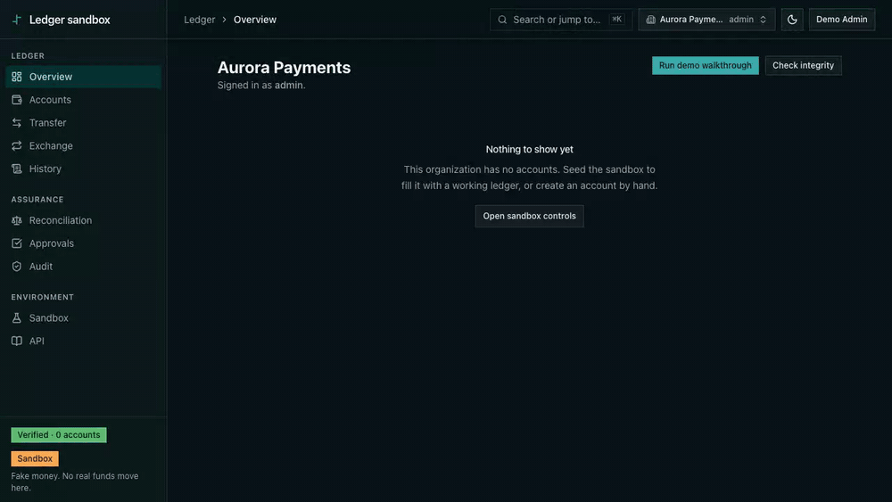

<div align="center">

# Ledger sandbox

**A payments-style, double-entry, multi-tenant ledger you can break in public.**

Fake money. Real correctness. Every transfer is a balanced set of postings, every balance
reconciles against its own history, retries never double-charge, and no organization can
see another's data.

[**▶ Open the live demo**](https://fintech-ledger-sandbox.up.railway.app) &nbsp;·&nbsp;
[API reference](https://api-fintech-ledger-sandbox.up.railway.app/api-reference) &nbsp;·&nbsp;
[Documentation wiki](https://github.com/Hoverla-Soft/fintech-ledger-sandbox/wiki)

[](https://fintech-ledger-sandbox.up.railway.app)
[](LICENSE)
[](docs/development/tech-stack.md)
[](docs/development/tech-stack.md)

</div>



---

## The problem this solves

Most financial software gets money movement wrong in the same few ways: a retry posts twice,
a balance drifts from its transaction history, a correction quietly edits the past, or one
customer's data surfaces in another's report. These are not exotic failures. They are the
default outcome of building a ledger on top of a CRUD app.

This repository is a working ledger built so those failures are **structurally impossible**
rather than carefully avoided — and it shows you the proof for each one, in a running app you
can click through in five minutes.

It is a reference implementation, not a product. The money is fake precisely so the
correctness can be real: you can seed it, break it, and reset it without consequences.

## See it in five minutes

Open the [**live demo**](https://fintech-ledger-sandbox.up.railway.app), create an account, and
follow the walkthrough. It is the same path recorded above.

| Step | What you see | What it proves |
|---|---|---|
| **1. Seed the sandbox** | Six accounts, a funding run, payroll, a marketplace payout, one refusal, one reversal | A realistic ledger in one click — nothing faked for the demo, every row went through the real write path |
| **2. Read the outcomes** | Five scenarios posted, `insufficient_funds` marked **refused as expected** | A ledger that never says *no* proves nothing. The refusal is seeded on purpose |
| **3. Open the fee split** | Three legs — seller 950.00, platform fee 50.00, against a 1 000.00 credit — with a **Nets to zero** badge | Money was distributed, not created. The badge re-sums the legs as integers in the browser |
| **4. Run reconciliation** | Every account's *recorded* balance beside the *computed* sum of its postings, drift column empty | The balance you are shown is provably the history you can read |
| **5. Create a second organization** | An empty ledger, and a real transaction URL from org one returning **not found** | Tenant isolation, demonstrated from the outside |

> The sandbox badge in the sidebar is not decoration. **No real funds move here.**

## What the ledger guarantees

Eight invariants. Each one is enforced somewhere specific and proven by something you can run —
not asserted in a paragraph.

| # | Guarantee | How it is held |
|---|---|---|
| 1 | **Money is conserved** | Every transaction is a set of ≥2 postings that net to zero, validated in a dependency-free domain package before anything touches the database |
| 2 | **Balances reconcile** | Each account's stored balance always equals the signed sum of its postings — verifiable across the whole organization on demand, not on a schedule |
| 3 | **All or nothing** | Postings, balance updates, the idempotency record, and the audit entry commit in one database transaction |
| 4 | **Retries are safe** | An idempotency key is reserved by a `UNIQUE` constraint, not a pre-check. Same key and same payload replays the original result; same key and a *different* payload is a `409`, never a second posting |
| 5 | **No cross-tenant leakage** | The acting organization is derived from a verified membership row and can never be sent as input. Backed by composite foreign keys and row-level security in Postgres itself |
| 6 | **Sufficient funds** | A customer account can never go negative; checked inside the row lock, so concurrent transfers cannot race past it |
| 7 | **One currency per transaction** | Mixed-currency legs are rejected at construction. Cross-currency movement goes through an explicit two-leg exchange instead |
| 8 | **History is append-only** | Database triggers reject `UPDATE`, `DELETE`, and `TRUNCATE` on postings. The only correction is a new, mirrored reversing transaction — the original stays visible, marked reversed |

Two consequences worth naming, because they surprise people:

- **"Reset" does not delete anything.** It posts a balanced compensating transaction that drives
  every balance to zero. The accounts stay, the history grows. A ledger that can erase its past
  is not a ledger.
- **A refused transfer still leaves a record.** The attempt rolls back completely, then the
  rejection is written in its own transaction — so the refusal survives the rollback that
  erased everything else.

## What is in the console

| Area | What it does |
|---|---|
| **Accounts** | Customer and external accounts, multi-currency, with balances and per-account history |
| **Transfer** | Balanced transfers including N-leg splits (a payout and its platform fee in one atomic entry) |
| **Exchange** | Cross-currency movement as an explicit two-leg operation, reversible as a unit |
| **History** | Paginated, filterable transaction list; every transaction opens to its full journal |
| **Reconciliation** | Recorded vs. computed balance for every account, re-runnable on demand |
| **Approvals** | Optional maker-checker: with it on, *every* direct balance change is refused and routed through an approval queue |
| **Audit** | Every posted transaction, every rejection, and every change to the approval setting itself |
| **Sandbox** | Seed a realistic ledger, or unwind it — both through the same write path as the API |
| **API** | The same operations as a typed RPC surface, with an OpenAPI reference generated from the schemas that validate the requests |

Roles are organization-scoped: **admin** writes, **viewer** reads. Neither can act outside its
own organization.

## Measured, not claimed

From a reproducible harness ([`scripts/bench/run.mjs`](scripts/bench/run.mjs)) against the
running API — Apple M3, loopback topology, seeded ledger. Full method, caveats, and the
complete tables are in [Benchmarks](docs/showcase/benchmarks.md).

| | p50 | p99 |
|---|---|---|
| `accounts.list`, 50 concurrent connections — 2 885 req/s | 16 ms | 24 ms |
| `dashboard.summary`, 50 concurrent connections — 1 753 req/s | 27 ms | 56 ms |
| Fresh transfer post | 4.91 ms | 17.95 ms (max) |
| Idempotent replay of that transfer | 2.87 ms | 4.94 ms (max) |

Every authenticated request above pays full price: session lookup and membership verification
on every call, never cached away. The replay path being consistently faster and tightly bounded
is the idempotency design showing up in the latency profile — a replay is a lookup, not a posting.

Correctness is held by **779 tests across five packages** — domain, database, API, server, and
console. The database and API suites are not mocked: they start a real PostgreSQL 18 through
Testcontainers and drive it, including the concurrency races the design claims to survive
(N simultaneous callers on one idempotency key producing exactly one transaction, and forbidden
`UPDATE`/`DELETE`/`TRUNCATE` statements issued against real postings and rejected).

## Built with

TypeScript end to end, in a pnpm + Turborepo monorepo.

**React 19** · **TanStack Router** · **TanStack Query** · **Tailwind CSS v4** · **Base UI**
· **Hono** · **oRPC** (typed RPC + generated OpenAPI) · **Better Auth** · **PostgreSQL 18** ·
**Drizzle ORM** · **Zod** · **Vitest** · **Playwright** · **Testcontainers** · **Biome**

The domain package that owns money arithmetic and the balanced-transaction rule has **zero
runtime dependencies** — no ORM, no validation library, not even a decimal package. Money is an
integer count of minor units in a `bigint`. Floating point never touches an amount.

## Documentation

The [**wiki**](https://github.com/Hoverla-Soft/fintech-ledger-sandbox/wiki) is the place to
start — it explains the system for people who did not write it.

For the engineering detail that lives beside the code:

| | |
|---|---|
| [Architecture](docs/showcase/architecture.md) | Four diagrams: system context, package graph, the transfer write path, the tenant-isolation model |
| [Security checklist](docs/showcase/security.md) | Every control, where it is enforced, what proves it — including the items honestly marked not done |
| [Benchmarks](docs/showcase/benchmarks.md) | The full measured tables, the method, and the caveats |
| [Teardowns](docs/showcase/README.md) | Three deep dives: conservation, idempotency under retries, multi-tenancy without leaks |
| [Decision records](docs/adr/) | Ten ADRs covering money representation, concurrency, idempotency, tenancy, and more |
| [Test coverage](docs/test-coverage.md) | What is covered, file by file — and what is not |

## Run it locally

Requires Node.js 22+, pnpm, and a running Docker daemon.

```bash
pnpm install
pnpm db:start        # Postgres 18 in Docker
pnpm db:migrate
pnpm dev             # console → :3001, API → :3000, OpenAPI → :3000/api-reference
```

Sign up, create an organization, then open **Sandbox → Run scenarios** to seed a working ledger.

```bash
pnpm test            # unit, component, and integration suites (integration needs Docker)
pnpm test:e2e        # Playwright, against a real browser
pnpm lint            # Biome — lint and format check
pnpm check-types     # TypeScript across every workspace
```

Setup detail, environment variables, and deployment notes are in the
[wiki](https://github.com/Hoverla-Soft/fintech-ledger-sandbox/wiki) and
[`docs/development/`](docs/development/).

## Honest limitations

This is a sandbox, and the documentation says so wherever it matters. The
[security checklist](docs/showcase/security.md) marks every outstanding item ⚠️ rather than
omitting it. In summary: the rate limiter counts in-process (correct for one process, wrong for
several), the connection pool carries no statement timeout, the operations runbook is still a
template, and there is no real-money, KYC, or payment-rail integration of any kind.

There is also no interest, no holds or authorizations, and no bank reconciliation. Those are
out of scope by decision, recorded in [`docs/product/requirements/ledger.md`](docs/product/requirements/ledger.md).

## License

MIT — see [LICENSE](LICENSE).

<div align="center">
<sub>Built by <a href="https://github.com/Hoverla-Soft">HoverlaSoft</a> as the reference implementation for its AI-first engineering standard.</sub>
</div>
