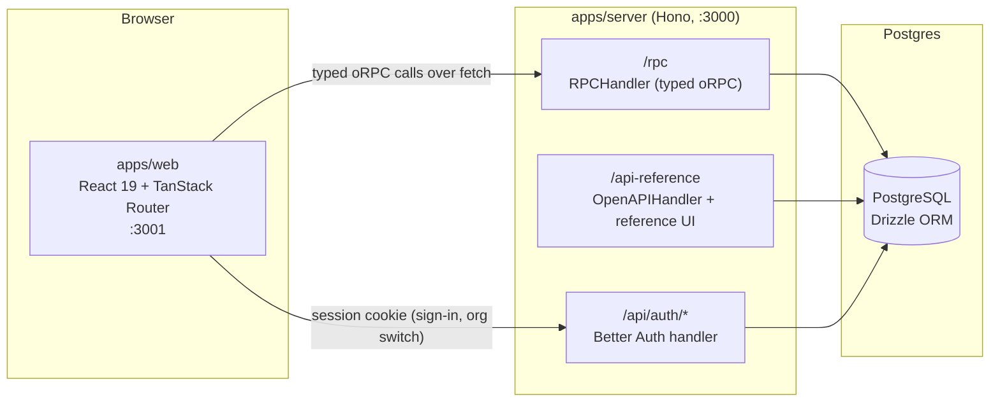
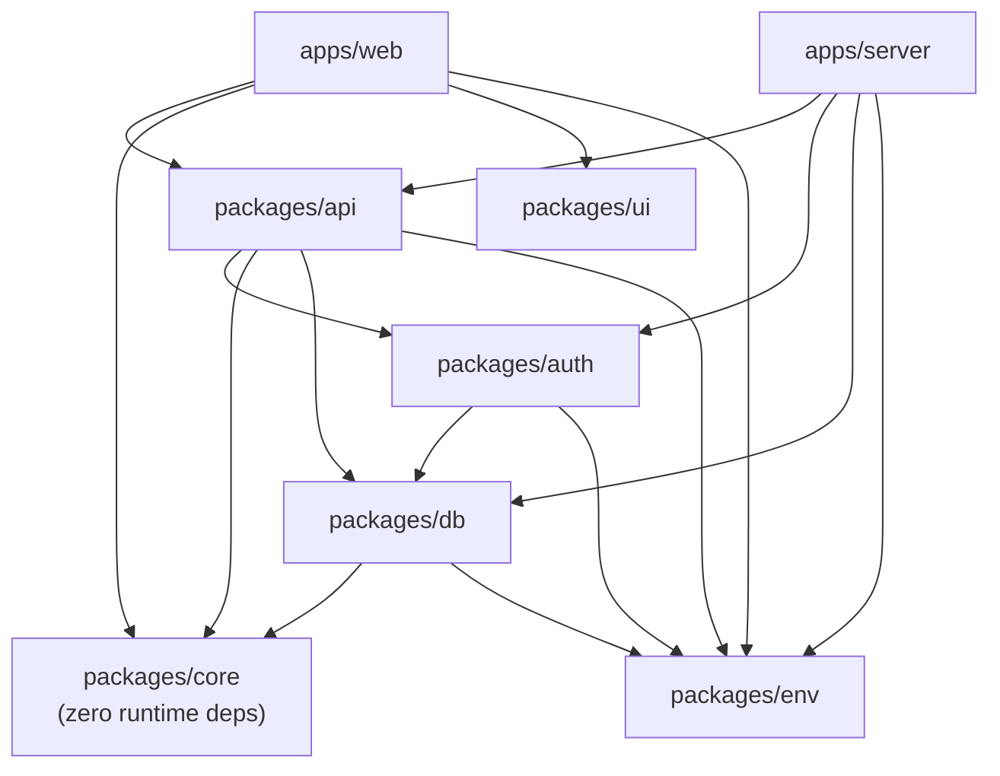
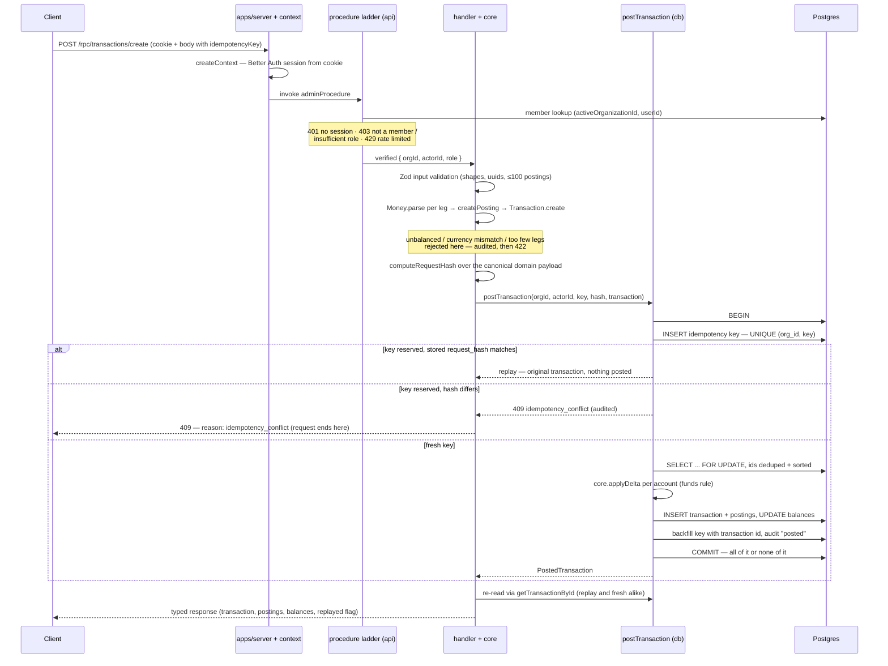
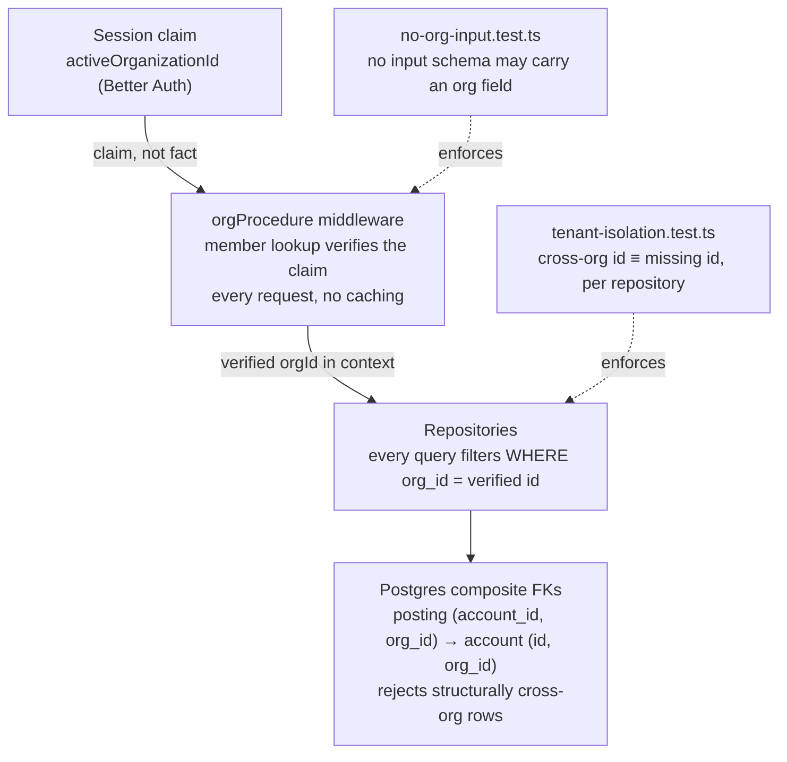

# Architecture

How the fintech ledger sandbox is put together, and where each guarantee is actually enforced. Every claim below links to the file that implements it — this page is a map, not a brochure. The deeper source of truth is [`docs/development/architecture.md`](../development/architecture.md) and the [ADRs](../adr/).

---

## 1. System context

One HTTP process serves three surfaces, all mounted in [`apps/server/src/index.ts`](../../apps/server/src/index.ts): the Better Auth handler at `/api/auth/*`, the typed RPC handler at `/rpc`, and the *same* router re-exposed as an OpenAPI document and reference UI at `/api-reference` — so the human-readable API docs are generated from the schemas that actually validate requests, and cannot drift from them.

The console talks to the API through an oRPC client ([`apps/web/src/utils/orpc.ts`](../../apps/web/src/utils/orpc.ts)) typed end-to-end against the router exported from `packages/api` — no hand-written client, no OpenAPI codegen step. Sessions are cookie-based (Better Auth, email + password in v1); [`packages/auth/src/index.ts`](../../packages/auth/src/index.ts) configures the Drizzle adapter and the organization plugin that makes the session carry `activeOrganizationId`. On every request, [`createContext`](../../packages/api/src/context.ts) resolves the cookie into a minimal `LedgerSession` (`{ userId, activeOrganizationId }`) — an anti-corruption boundary so routers never depend on Better Auth's plugin-shaped session type, and tests can build a context from a plain object.

Error logging is deliberately selective: `logUnexpectedError` in [`apps/server/src/index.ts`](../../apps/server/src/index.ts) skips typed 4xx errors, because an expected `404` is control flow, not an incident.

> ⚠️ Honest gaps: structured logging (pino), security headers, and error monitoring are declared but not yet delivered — tracked openly in [`docs/development/tech-stack.md`](../development/tech-stack.md) → Status, not papered over.

---

## 2. Monorepo package graph

pnpm workspaces + Turborepo (`apps/*`, `packages/*` in [`pnpm-workspace.yaml`](../../pnpm-workspace.yaml)). The graph below is drawn from the actual `dependencies` in each workspace `package.json`, not from the docs:

The direction is one-way and acyclic: `apps/*` → `packages/api` → (`core`, `db`, `auth`) → `env`, with `packages/config` as a shared dev-only tsconfig base. Two edges are worth calling out:

- **`packages/core` depends on no sibling — and no runtime dependency at all.** Its [`package.json`](../../packages/core/package.json) has an empty `dependencies` section; even Zod is banished to the contract boundary. The domain (Money as bigint minor units, balanced `Transaction`, account rules — [`packages/core/src/index.ts`](../../packages/core/src/index.ts)) is unit-tested with no database. This purity is the property the reference implementation exists to demonstrate.
- **`packages/db` → `packages/core` is a deliberate leaf edge.** The posting routine reuses `core.applyDelta` and `Transaction` at runtime rather than restating the funds rule in SQL — one implementation of each invariant, ever ([`docs/development/architecture.md`](../development/architecture.md)).

Packages export TypeScript **source** through public `exports` (e.g. [`packages/db/package.json`](../../packages/db/package.json) declares curated subpaths like `./posting`, `./repositories`, `./testing`), transpiled by each consuming app's bundler — a documented divergence recorded in [ADR 0001](../adr/0001-internal-package-src-exports.md). What survives the relaxation: imports only through public entry points, never into internal file paths, and end-to-end type inference (the `AppRouter` type flows from `packages/api` into `apps/web` with no build step).

---

## 3. Transfer write path

The full flow of `transactions.create`, verified against [`packages/api/src/procedures.ts`](../../packages/api/src/procedures.ts), [`packages/api/src/routers/transactions.ts`](../../packages/api/src/routers/transactions.ts), and [`packages/db/src/posting/post-transaction.ts`](../../packages/db/src/posting/post-transaction.ts):

Design decisions behind the shape of this diagram, each with its record:

- **Authorization is the ladder, not handler code.** `publicProcedure → protectedProcedure → orgProcedure → adminProcedure` in [`procedures.ts`](../../packages/api/src/procedures.ts); which rung a procedure builds on *is* its access-control decision. The rate limiter runs after the role check, so a rejected viewer cannot burn an org's write quota.
- **Idempotency is decided by the database, not a pre-check.** `reserveIdempotencyKey` ([`packages/db/src/posting/reserve-key.ts`](../../packages/db/src/posting/reserve-key.ts)) uses a plain blocking `INSERT` against `UNIQUE (org_id, key)` — deliberately not `ON CONFLICT DO NOTHING`, which lets two concurrent callers both proceed under `READ COMMITTED`. Replay vs. conflict is decided by comparing the stored `request_hash`, derived from the *validated domain payload* with legs sorted, so a retry that reorders legs or spells `10.0` as `10.00` replays instead of falsely conflicting ([ADR 0004](../adr/0004-idempotency.md), [ADR 0006](../adr/0006-write-endpoint-contract.md)).
- **Deadlock is structurally impossible, not retried away.** [`lockAccounts`](../../packages/db/src/posting/lock-accounts.ts) dedupes and **sorts** account ids before one `SELECT ... FOR UPDATE`, so concurrent transfers always acquire locks in the same relative order ([ADR 0003](../adr/0003-balance-and-concurrency.md)).
- **The funds rule has one implementation.** Inside the lock, `postTransaction` calls `core.applyDelta` per account rather than a SQL `WHERE balance + delta >= 0` — persistence trusts the domain, never restates it.
- **A rejection is atomic *and* recorded — which takes two transactions.** The failing attempt rolls back everything (including its key reservation); the `rejected` audit row is then written in its own transaction, because a row written inside the aborting one would vanish with it ([ADR 0003](../adr/0003-balance-and-concurrency.md), [`packages/api/src/routers/transactions.ts`](../../packages/api/src/routers/transactions.ts) for pre-persistence failures).
- **Postings are append-only at the database level.** Triggers reject `UPDATE`, `DELETE`, *and* `TRUNCATE` (the statement-level trigger exists because `TRUNCATE` never fires row-level ones — a real gap caught in review, [ADR 0003](../adr/0003-balance-and-concurrency.md)). Corrections are reversals: `transactions.reverse` rebuilds mirrored legs from **persisted rows**, never the request body ([ADR 0006](../adr/0006-write-endpoint-contract.md)).

This path is tested against a real Postgres via Testcontainers: [`post-transaction.concurrency.test.ts`](../../packages/db/src/posting/post-transaction.concurrency.test.ts) and [`post-transaction.atomicity.test.ts`](../../packages/db/src/posting/post-transaction.atomicity.test.ts) exercise the races the design claims to survive.

> ⚠️ Reversing a reversal is allowed and undeduplicated by design; `reversedBy` makes it detectable but nothing blocks a chain. The trade-off — and the clause the original ADR got wrong — is recorded in [ADR 0006](../adr/0006-write-endpoint-contract.md)'s consequences.

---

## 4. Tenant isolation model

Isolation is enforced in four layers, so no single forgotten `WHERE` clause can breach it ([ADR 0005](../adr/0005-tenant-isolation.md), [ADR 0009](../adr/0009-console-session-and-tenant-model.md)):

- **The org is derived, never accepted as input.** No procedure schema contains an `orgId` — and that is machine-checked: [`no-org-input.test.ts`](../../packages/api/src/routers/no-org-input.test.ts) walks the real router, introspects the real Zod schemas, and fails if a forbidden field ever appears. A future endpoint cannot reintroduce the hole without a red test.
- **The session's claim is verified on every request.** [`requireOrg`](../../packages/api/src/procedures.ts) resolves `activeOrganizationId` through a `member` row lookup; a session naming an org the user left fails with `403`. No caching, deliberately — revocation takes effect on the very next request, with no stale-elevation window.
- **No existence oracle.** A cross-tenant id returns the byte-identical `404` a missing id does; `403` covers both "not a member" and "org does not exist", so neither accounts nor organizations are enumerable ([ADR 0005](../adr/0005-tenant-isolation.md)).
- **The database backs the code up.** [`packages/db/src/schema/ledger.ts`](../../packages/db/src/schema/ledger.ts) gives `ledger_posting` composite `(account_id, org_id)` and `(transaction_id, org_id)` foreign keys, so Postgres itself rejects a posting whose org disagrees with its account's owner — even if a future code path forgets the predicate. [`tenant-isolation.test.ts`](../../packages/db/src/repositories/tenant-isolation.test.ts) covers every read repository plus the posting routine, positive and cross-org cases both.
- **The console holds no org copy.** The active org lives only in the Better Auth session; switching orgs calls `queryClient.clear()`, because no query key carries an `orgId` (that is the point) and a stale cache would *look* like a tenant leak in a system whose isolation is intact ([ADR 0009](../adr/0009-console-session-and-tenant-model.md)).

> ⚠️ Two open edges, recorded rather than hidden: ADR 0005 governs `packages/api` only — a future job talking to `packages/db` directly must derive `org_id` on its own (composite FKs still block structurally cross-org *writes*); and the console derives its role hint client-side from the shared `toLedgerRole` mapping — an affordance only, enforcement stays server-side — pending a `session.context` procedure ([ADR 0009](../adr/0009-console-session-and-tenant-model.md)).
