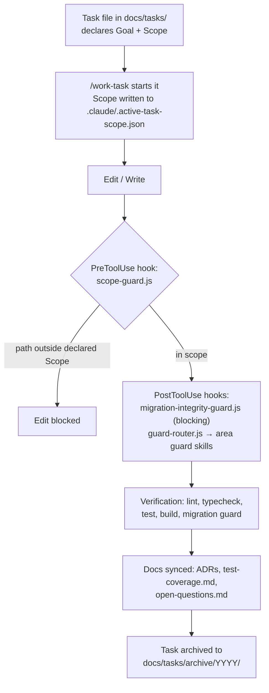

# How this repo gets built

This repository is the reference implementation of HoverlaSoft's AI-first engineering standard. The ledger is the demo; **the process is the product**. Every mechanism described below is in this repo, running, and linked — nothing here is aspirational.

The shape of it:



---

## 1. Every change starts as a scoped task file

No non-trivial change begins as an edit. It begins as a file in [`docs/tasks/`](../tasks/), copied from [`TEMPLATE.md`](../tasks/TEMPLATE.md), which forces the questions that are cheap before coding and expensive after:

- **Goal** — the outcome, not implementation steps
- **Scope (allowed paths)** — every file, glob, or package the task may touch. The template is explicit that this "is the actual enforcement boundary, not a suggestion"
- **Out of scope** — what *not* to fix while you're in there
- **Acceptance criteria** and a **Verification** block — the exact commands that must pass
- **Spec completeness checklist** — copied from [`docs/product/FEATURE-CHECKLIST.md`](../product/FEATURE-CHECKLIST.md); every item checked or marked `N/A: <reason>`, never left blank

Worked example: `2026-07-27-phase-4b-write-endpoints.md`, the task that made the ledger writable. Task files are working records rather than product documentation, so the archive was pruned once its durable decisions had graduated into the ADRs; that file is recoverable from git history (`git log --diff-filter=D -- docs/tasks/`) and is worth reading in full for the record this process leaves behind: three pre-existing defects found by survey and folded into scope, nine design decisions resolved *before* implementation, a mid-task scope expansion documented with its reasoning (extracting `getPostgresErrorCode` into `internal/pg-errors.ts` rather than duplicating SQLSTATE detection), and an adversarial review whose confirmed findings — five distinct defects, two of them in the task's own tests — are written up with fixes in the Status section. Its recorded verification: 246 tests passed across core, db, and api.

Finished tasks move to `docs/tasks/archive/YYYY/`, and are eventually pruned from it. Thirty-nine task files covering phases 2 through 7 were written and then removed this way; the archive is empty by design, not by neglect. Task files are working records, and the rule is that durable decisions graduate into ADRs, `docs/product/`, and `docs/development/` *before* a task is archived — so a pruned archive should cost nothing. The eleven ADRs are where that record actually lives.

Commit discipline follows the same one-slice-per-change shape: conventional commits scoped to the package they touch (`feat(approvals):`, `fix(infrastructure):`, `test(web):` — see `git log --oneline`).

## 2. Scope is enforced by tooling, not discipline

The Scope section is machine-read. [`.claude/settings.json`](../../.claude/settings.json) registers a `PreToolUse` hook that runs before every file edit:

```json
"PreToolUse": [
  {
    "matcher": "Edit|Write|NotebookEdit",
    "hooks": [
      {
        "type": "command",
        "command": "node",
        "args": ["${CLAUDE_PROJECT_DIR}/.claude/scripts/scope-guard.js"]
      }
    ]
  }
]
```

[`scope-guard.js`](../../.claude/scripts/scope-guard.js) reads the active task's declared Scope (written by `/work-task` to `.claude/.active-task-scope.json`) and exits non-zero for any edit outside it — the edit is **blocked**, not flagged. An agent that drifts into "while I'm here" refactoring hits a wall instead of a code-review comment three days later. Two design points worth noting in the source:

- It **fails open** on anything unexpected (malformed state, no active task) — a broken guardrail should never be the reason a legitimate edit gets stuck.
- It supports per-session scope files (`.active-task-scope.<session_id>.json`) so parallel agent sessions cannot inherit or overwrite one another's boundaries, and a session with no registered scope of its own is blocked rather than silently borrowing a teammate's.

If a task genuinely needs a path outside its Scope, the only way forward is to say so and update the task file — which is exactly the audit trail the Phase 4b example above shows.

## 3. Guard skills review every edit in their area

A second hook runs *after* every edit. [`guard-router.js`](../../.claude/scripts/guard-router.js) matches the edited path against [`.claude/guard-routes.json`](../../.claude/guard-routes.json) and injects an instruction to run the matching reviewer skill(s) before the change is considered done. The routing table maps ten guards onto the repo's actual layout:

| Guard | Fires on |
|---|---|
| `configuration-guard` | `tsconfig*`, `package.json`, `pnpm-workspace.yaml`, `turbo.json`, Biome/Vite/Vitest/drizzle configs |
| `infrastructure-guard` | `.github/workflows/**`, Dockerfiles, `docker-compose*`, `docs/operations/**` |
| `database-migration-guard` | `**/migrations/**`, `**/drizzle/**`, seeds |
| `db-architecture-guard` | `packages/db/**`, drizzle config, migrations |
| `backend-architecture-guard` | `packages/core`, `packages/api`, `packages/db`, `packages/auth`, `apps/server` |
| `backend-reliability-security-guard` | `packages/api`, `packages/db`, `packages/auth`, `packages/env`, `apps/server`, migrations |
| `integration-spec-guard` | `packages/integrations/**`, `docs/integrations/**` |
| `frontend-component-structure-guard` | `apps/web/**`, `packages/ui/**` |
| `frontend-fetch-guard` | `apps/web/**` |
| `spec-completeness-guard` | `docs/tasks/**`, `docs/product/requirements/**`, `docs/product/user-flows/**` |

One path can trigger several guards — an edit under `packages/db/` gets architecture, db-design, migration, and reliability review at once.

Two enforcement strengths, deliberately: the guard router *reminds* (it emits context, never blocks — see the comment at the top of its source), while [`migration-integrity-guard.js`](../../.claude/scripts/migration-integrity-guard.js) — which validates Drizzle journal integrity on every migration/seed edit — **blocks** on failure (`exit(2)`) and runs again in CI as `node .claude/scripts/migration-integrity-guard.js --check`. Deleting, renumbering, renaming, or detaching a migration from its journal cannot be done quietly; content-level immutability of applied migrations is checked at apply time against the database, not by this script.

## 4. Decisions are recorded as ADRs

[`docs/adr/`](../adr/README.md) holds the load-bearing decisions — short, immutable once accepted, superseded rather than edited. All ten:

| # | Decision |
|---|---|
| [0001](../adr/0001-internal-package-src-exports.md) | Internal packages export TypeScript source, not `dist` — the Turborepo "internal packages" pattern, as a documented divergence |
| [0002](../adr/0002-money-representation.md) | Money is integer minor units in native `bigint`, with a known-exponent currency allowlist — an unknown currency is rejected, never defaulted to exponent 2 |
| [0003](../adr/0003-balance-and-concurrency.md) | Materialized balances + ordered `SELECT … FOR UPDATE` + trigger-enforced immutability; reconciliation as a continuously-asserted invariant |
| [0004](../adr/0004-idempotency.md) | Client-supplied idempotency keys enforced by DB uniqueness via a blocking plain `INSERT` — with the analysis of why `ON CONFLICT DO NOTHING` double-posts under concurrency |
| [0005](../adr/0005-tenant-isolation.md) | The acting org is derived from a verified `member` row, never accepted as input; category-based `403`/`404` so neither orgs nor resources are enumerable |
| [0006](../adr/0006-write-endpoint-contract.md) | Raw N-leg postings over a "transfer" shape; request hash over sorted canonical legs; every pre-persistence rejection audited |
| [0007](../adr/0007-rate-limiting.md) | Rate limiting on `adminProcedure` (the write set by construction), keyed by the server-derived `orgId` with a secondary per-user limit |
| [0008](../adr/0008-sandbox-reset.md) | Sandbox reset is a balance-compensating entry — never a deletion, never a per-transaction reversal — bounded and resumable |
| [0009](../adr/0009-console-session-and-tenant-model.md) | Console tenancy: active org is Better Auth session state; client-side role is an affordance hint pinned by an agreement test against the server's mapping |
| [0010](../adr/0010-cross-currency-exchange.md) | Cross-currency exchange is two linked single-currency transactions, so every existing invariant survives untouched; the FX position sits openly on bridge accounts |

The ADRs record failure analysis, not just choices — 0004's "Implementation gotcha" section documents a real bug (drizzle-orm wrapping the Postgres error code one level too deep) that would have silently broken idempotency under exactly the concurrent-retry scenario the invariant exists for.

## 5. The quality gate

The commands a task's Verification block declares are the same commands CI runs (all but the local-only e2e line below) — [`.github/workflows/ci.yml`](../../.github/workflows/ci.yml) says so in its own header comment, and names the task template as the source of truth if they ever diverge:

```bash
pnpm audit --audit-level=high   # dependency advisories (added 2026-08-16; Dependabot opens the PRs)
pnpm lint            # Biome 2.5.6 — lint + format in one root-level pass
                     #   (biome check --error-on-warnings . — warnings fail, not just errors)
pnpm check-types     # tsc per workspace via turbo (strict, noUncheckedIndexedAccess from the shared base tsconfig)
pnpm test            # Vitest 4 — core (pure unit), db + api (integration against real
                     #   Postgres via Testcontainers), web (happy-dom component suite)
pnpm build
node .claude/scripts/migration-integrity-guard.js --check
pnpm test:e2e        # Playwright — local only; deliberately not yet a CI job (open question #9)
```

The integration suites are the notable part: `packages/db` and `packages/api` test against a **real Postgres** started by Testcontainers, not mocks — atomicity via injected mid-transaction failure, idempotency under genuinely concurrent connections, tenant isolation with positive and negative controls per repository, immutability including the `TRUNCATE` case that row-level triggers miss. [`docs/test-coverage.md`](../test-coverage.md) indexes every test file, one line per behavior covered, and [`docs/development/testing-rules.md`](../development/testing-rules.md) documents the harness — including why the Testcontainers suites are opted out of Turborepo's cache (a cached "pass" that never touched Docker is worse than a rerun). CI deliberately uses no Postgres service container and asserts `docker info` first, so a missing daemon fails loudly instead of skipping the suites; it also sets throwaway env values explicitly rather than `SKIP_ENV_VALIDATION`, keeping the Zod env schemas exercised.

Honest gaps, on the record in [`docs/open-questions.md`](../open-questions.md):

- ⚠️ **CI has never run — at all.** This bullet used to say "CI reports but does not gate", which was too generous by one whole step. `gh run list` returns every run from 2026-07-28 onward as `failure` in 3–9 seconds, each annotated *"The job was not started because your account is locked due to a billing issue."* The workflow file is correct; the GitHub account is locked. So CI does not gate **and it does not report**, and every green check described on this page has only ever passed on a developer laptop (item #10). Branch protection (item #17) is a further step that cannot even be attempted until a run succeeds.
- ⚠️ **E2e coverage is deliberately thin: 3 specs.** Specs driving account creation and transfer were written, flaked across runs on a Base UI `Select` interaction, and were **removed** — a test that answers differently for identical code is worse than no test. Those flows stay covered by the component and API suites; the browser-level gap is recorded (item #9).
- ⚠️ **Maker-checker is enforced only in the browser.** `transactions.create` never reads the org's `requireTransferApproval` flag, so an admin can post straight past the approval queue by calling the API directly (item #25). Recorded here because it is a *security* gap on a page about engineering discipline, and omitting it would make this list flattering rather than honest.
- ✅ **`pnpm lint` used to exit 0 with 26 sub-error diagnostics outstanding** (item #16) — closed 2026-08-15/16. All 26 are gone, and the script is now `biome check --error-on-warnings .`, so the clean state is an enforced floor rather than a snapshot. Kept here rather than deleted: a gaps list that only ever shrinks by deletion stops being a record.
- ✅ **The `apps/web` suite's timing sensitivity** (item #19) — closed 2026-08-16 by `testTimeout: 15_000`, chosen from measurement (1.3s slowest in isolation vs 5351ms under four-way `turbo` contention) rather than by raising it until green. Deliberately *not* closed with blanket retries.

## 6. Docs are the source of truth agents read

No skill or agent in this repo hardcodes a framework. When one needs to know "React or Vue," "Drizzle or Prisma," it reads [`docs/development/tech-stack.md`](../development/tech-stack.md) — and that file is kept honest against the code, including corrections that document their own history (the Forms row was corrected from a stale "React Hook Form" declaration to the `@tanstack/react-form` the code actually uses, with the reasoning inline). Installing anything not declared there requires filling the row in first — a rule stated in [`CLAUDE.md`](../../CLAUDE.md), the auto-loaded constitution that points at everything else.

The same pattern repeats across the doc set: [`coding-rules.md`](../development/coding-rules.md) holds code-level conventions (framework-agnostic on purpose), [`test-coverage.md`](../test-coverage.md) answers "is there a test for X" without grepping, and [`open-questions.md`](../open-questions.md) is where anything unconfirmed gets written down instead of silently assumed — its resolved rows keep their post-mortems (item #14 records that a config change deferred as "a wide diff" measured out at zero errors: "worth measuring before deferring next time").

That loop — decide, write it down, make the tooling read what was written — is the standard this repo exists to demonstrate.
