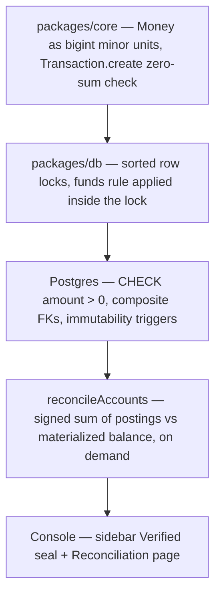
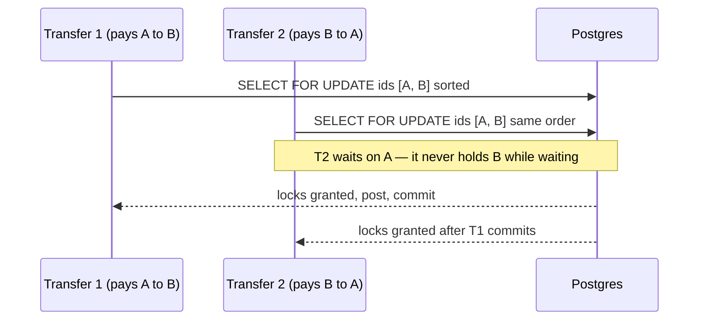

# Teardown #1 — Money that can't go missing

A ledger has one job: after any number of transfers, retries, reversals, and concurrent writers, every unit of money is still accounted for. This repo treats that as a stack of enforced invariants, not a convention — each layer catches what the layer above physically cannot. This teardown walks that stack bottom to top, with the actual code.



## Step 1: floating point is banned

[ADR 0002](../../adr/0002-money-representation.md) disqualifies `number` for amounts twice over: IEEE-754 doubles can't represent most decimal fractions (`0.1 + 0.2 !== 0.3`), and even integer-scaled `number` hits `Number.MAX_SAFE_INTEGER` — a real ceiling for an aggregate summing every posting in history. Decimal libraries were considered and rejected to keep `packages/core` dependency-free. The primitive that remains is native `bigint`: exact, arbitrary-precision, nothing to audit.

Every amount is a `Money`: integer **minor units** in a `bigint`, paired with a currency whose ISO-4217 exponent is on an explicit allowlist. The type says `bigint` — and the constructor checks it anyway, because untyped JSON crossing the API boundary is the realistic threat:

```ts
  static ofMinorUnits(
    minorUnits: bigint,
    currency: string,
  ): Result<Money, UnsupportedCurrency | InvalidAmount> {
    if (typeof minorUnits !== "bigint") {
      return err({
        kind: "InvalidAmount",
        reason: "not-a-bigint",
        input: describeUnknownAmount(minorUnits),
      });
    }
```

— [`packages/core/src/money/money.ts`](../../../packages/core/src/money/money.ts)

`Money.parse` never rounds. A decimal string with more fraction digits than the currency permits is rejected, because silent rounding is precisely how money quietly goes missing:

```ts
    const fractionDigits = fractionPart ?? "";
    if (fractionDigits.length > exponent) {
      return err({ kind: "InvalidAmount", reason: "excess-precision", input: decimal });
    }
```

— [`packages/core/src/money/money.ts`](../../../packages/core/src/money/money.ts)

An unknown currency code is likewise refused rather than defaulted to two decimals — treating a 3-decimal currency (BHD, KWD) as 2-decimal is a silent 100× error. The allowlist in [`packages/core/src/money/currency.ts`](../../../packages/core/src/money/currency.ts) covers all three real-world exponent scales (0, 2, 3), each exercised in [`money.test.ts`](../../../packages/core/src/money/money.test.ts).

On the wire, amounts travel as decimal *strings*, never JSON numbers — `bigint` doesn't survive `JSON.stringify`, and ADR 0002 records that as a deliberate downstream obligation on the API layer, not an accident.

## Step 2: a transfer is a balanced set of postings — or it doesn't exist

There is no "amount, from, to" transfer object anywhere in the domain. A transfer is a `Transaction`: two or more postings, one currency, every leg strictly positive, and a signed sum of exactly zero. The only way to obtain an instance is `Transaction.create`, which runs the conservation check before the constructor ever executes:

```ts
    let netMinorUnits = 0n;
    for (const posting of postings) {
      netMinorUnits += signedAmount(posting).minorUnits;
    }

    if (netMinorUnits !== 0n) {
      const net = unwrapInvariant(
        Money.ofMinorUnits(netMinorUnits, currency),
        "unbalanced net amount uses the transaction's already-validated currency",
      );
      return err({ kind: "UnbalancedTransaction", net });
    }
```

— [`packages/core/src/transaction/transaction.ts`](../../../packages/core/src/transaction/transaction.ts)

The sign convention is defined once, in one function, and every other layer depends on it rather than restating it:

```ts
export function signedAmount(posting: Posting): Money {
  return posting.direction === "debit" ? posting.amount : posting.amount.negate();
}
```

— [`packages/core/src/transaction/posting.ts`](../../../packages/core/src/transaction/posting.ts)

The constructor then freezes the postings array *and* every element, so a caller holding a mutable reference can't unbalance an already-validated transaction after the fact — a runtime guarantee, not just a `readonly` annotation. Reversal (`reverse`) mirrors every leg's direction, which provably preserves balance, so it returns a bare `Transaction` rather than a `Result`.

## Step 3: balances under concurrency

[ADR 0003](../../adr/0003-balance-and-concurrency.md) picks **materialized balance, continuously-asserted reconciliation**: `ledger_account.balance` is a `bigint` column updated in the same Postgres transaction that inserts the postings, and `ledger_posting` — append-only — remains the source of truth the balance must always agree with.

Concurrent transfers touching the same accounts are serialized by row locks, acquired in one query over de-duplicated, **sorted** ids:

```ts
  const sortedIds = [...new Set(accountIds)].sort();

  const rows =
    sortedIds.length === 0
      ? []
      : await tx
          .select()
          .from(ledgerAccount)
          .where(and(eq(ledgerAccount.orgId, orgId), inArray(ledgerAccount.id, sortedIds)))
          .for("update");
```

— [`packages/db/src/posting/lock-accounts.ts`](../../../packages/db/src/posting/lock-accounts.ts)

Sorting is the deadlock story in its entirety: two transfers touching the same pair in opposite directions request locks in the same relative order, so neither can hold one lock while waiting on the other. Structural, not retry-and-hope.



With the rows locked, the funds rule runs — and it lives in `packages/core`, not in SQL, so it exists exactly once:

```ts
  const resulting = unwrapInvariant(
    balance.add(delta),
    "balance and delta currency were already confirmed to match the account currency",
  );

  if (account.type === "normal" && resulting.isNegative()) {
    return err({ kind: "InsufficientFunds", accountId: account.id, balance, delta, resulting });
  }

  return ok(resulting);
```

— [`packages/core/src/account/account.ts`](../../../packages/core/src/account/account.ts), called per account by [`post-transaction.ts`](../../../packages/db/src/posting/post-transaction.ts) inside the locked section

Underneath all of that, Postgres holds its own line: `CHECK (amount > 0)` on postings, composite `(id, org_id)` foreign keys so a posting can never point across tenants, and a pair of triggers making history append-only — including the `TRUNCATE` case a row-level trigger alone would miss (a real gap caught in review, per ADR 0003):

```sql
CREATE TRIGGER "ledger_posting_immutability_trigger"
BEFORE UPDATE OR DELETE ON "ledger_posting"
FOR EACH ROW
EXECUTE FUNCTION "ledger_posting_block_mutation"();
--> statement-breakpoint
DROP TRIGGER IF EXISTS "ledger_posting_immutability_truncate_trigger" ON "ledger_posting";
--> statement-breakpoint
CREATE TRIGGER "ledger_posting_immutability_truncate_trigger"
BEFORE TRUNCATE ON "ledger_posting"
FOR EACH STATEMENT
EXECUTE FUNCTION "ledger_posting_block_mutation"();
```

— [`packages/db/drizzle/0002_ledger_posting_immutability_trigger.sql`](../../../packages/db/drizzle/0002_ledger_posting_immutability_trigger.sql), exercised against real Postgres in [`ledger-immutability.test.ts`](../../../packages/db/src/schema/ledger-immutability.test.ts)

The concurrency claims are tested with actual parallel writers against actual Postgres, not mocks: [`post-transaction.concurrency.test.ts`](../../../packages/db/src/posting/post-transaction.concurrency.test.ts) races concurrent withdrawals against one `normal` account and asserts it never goes negative — then runs `reconcileAccounts` over the wreckage and asserts every account still reconciles.

## Step 4: reconciliation re-proves it, any time

Because the balance is materialized, nothing *forces* it to stay equal to the posting history — so the system carries its own auditor. `reconcileAccounts` (built in Phase 3 alongside [ADR 0003](../../adr/0003-balance-and-concurrency.md), surfaced in the console in phase 5f) recomputes each account from first principles, in SQL, using the same sign convention `core` defined:

```ts
function signedPostingSum() {
  return sql<
    string | null
  >`sum(case when ${ledgerPosting.direction} = 'debit' then ${ledgerPosting.amount} else -${ledgerPosting.amount} end)`;
}
```

— [`packages/db/src/repositories/reconciliation.ts`](../../../packages/db/src/repositories/reconciliation.ts)

Two details show the level of care: a `LEFT JOIN` keeps posting-less accounts in the check (an `INNER JOIN` would silently skip exactly the accounts nobody is watching), and the whole-org verdict comes from a separate aggregate (`countReconciliation`) rather than a fold over whatever page the caller fetched — a page of clean accounts must never report a clean ledger while drift sits on page two. [`reconciliation.test.ts`](../../../packages/db/src/repositories/reconciliation.test.ts) proves the check has teeth by corrupting a materialized balance behind the routine's back and asserting the mismatch is caught.

The [`reconciliation.verify`](../../../packages/api/src/routers/reconciliation.ts) endpoint exposes this to both roles — catching drift is not a privileged operation — and the console wears the result permanently. The sidebar **Verified** seal ([`integrity-seal.tsx`](../../../apps/web/src/features/assurance/integrity-seal.tsx), mounted in [`sidebar.tsx`](../../../apps/web/src/components/shell/sidebar.tsx) and the top bar) is that same whole-org aggregate, rendered on every screen:

```ts
  const { allReconciled, accountCount, unreconciledCount } = reconciliation.data;
  const label = allReconciled
    ? compact
      ? "Verified"
      : `Verified · ${accountCount} ${accountCount === 1 ? "account" : "accounts"}`
    : compact
      ? "Drift"
      : `Drift · ${unreconciledCount} of ${accountCount}`;
```

— [`apps/web/src/features/assurance/integrity-seal.tsx`](../../../apps/web/src/features/assurance/integrity-seal.tsx)

It links to the full [Reconciliation page](../../../apps/web/src/routes/_auth/reconciliation.tsx), which shows recorded vs computed balance per account and, on failure, the exact signed drift — computed with `BigInt` over the wire strings, never `Number` ([`drift.ts`](../../../apps/web/src/features/reconciliation/drift.ts)).

## ⚠️ Honest gaps

- **A privileged Postgres role can disarm the immutability triggers** (`DISABLE TRIGGER`, `session_replication_role = replica`). ADR 0003 says so explicitly and notes the missing control: nothing in `docs/operations/` yet owns provisioning an app role that lacks `ALTER TABLE`. The trigger is real; the role policy around it is an open question.
- **The README's "theater" step is stale.** Step 4 of the 5-minute demo mentions a money-flow theater; that view was removed in a later cleanup commit and [`apps/web/src/features/theater/`](../../../apps/web/src/features/theater) is currently empty. The live conservation proof in the UI today is the dashboard's per-currency **Conserved** column, the seal, and the Reconciliation page.
- **Reconciliation is assert-on-demand, not a background alarm.** Deliberate per ADR 0003 (a console polling it would imply the ledger needs supervision), and the seal caches its answer for 30 seconds — but it does mean drift surfaces when someone asks, not the instant it happens.

## See it yourself

From the [README](../../../README.md) 5-minute demo, the conservation-focused path:

1. `pnpm db:start`, `pnpm dev`, open http://localhost:3001 and create an account + organization.
2. Go to **Sandbox** and click **Run scenarios** — the demo walkthrough posts funding → payroll → marketplace fee split → an *expected* insufficient-funds refusal → reversal.
3. Watch the sidebar **Verified** seal stay green through all of it — including the refusal, which posts nothing and is recorded in the audit log instead.
4. Open **Reconciliation** for the full per-account check: recorded balance, computed balance, and a whole-org verdict that doesn't depend on which page you're looking at.
5. On the dashboard, the per-currency **Conserved** column shows held funds exactly mirrored by the external accounts — conservation, per currency, at a glance.

The ledger never asks you to trust the balance column. It re-derives it, in front of you, from the postings — and shows you the arithmetic.
