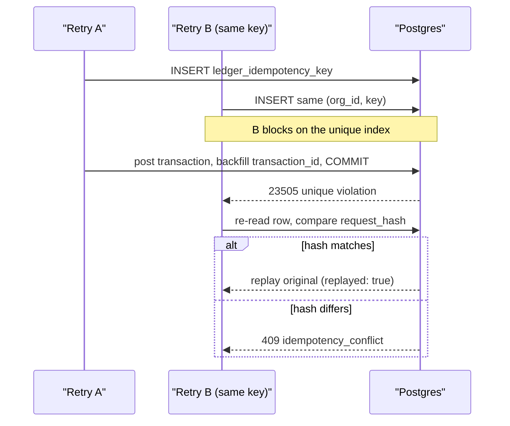

# Teardown #2 — Idempotency that survives retries

Every payments API eventually faces the same question: *"the connection timed out — did my transfer actually post?"* The client cannot know. If it retries and the first attempt succeeded, money moves twice. If it doesn't retry and the first attempt failed, money never moves. The only safe answer is an idempotency-key contract, and the interesting part is not having one — it's making it hold under **concurrent** retries, where naive implementations quietly double-post.

This teardown walks the actual implementation in this repo, bottom to top: the database reservation, the "same payload" fingerprint, the wire contract, and the tests that prove it.

## The contract

Recorded in [ADR 0004](../../adr/0004-idempotency.md) and [ADR 0006](../../adr/0006-write-endpoint-contract.md), enforced end to end:

| Client sends | Result |
|---|---|
| New key | Fresh post, `"replayed": false` |
| Same key + same payload | **Replay** of the original result — same transaction id, nothing posted again, `"replayed": true` |
| Same key + different payload | **`409 CONFLICT`**, `reason: "idempotency_conflict"` — never a silent replay of the wrong thing |
| Same key, original attempt was rejected | Rejected reservations roll back entirely, so the key is free to retry |

The key travels in the request **body** (`idempotencyKey`, a field of the input schema in [`packages/api/src/routers/transactions.ts`](../../../packages/api/src/routers/transactions.ts)), not an `Idempotency-Key` header — a deliberate ADR 0006 decision with an honestly documented cost (see gaps below).

## Step 1: reserving the key — why plain `INSERT`, not `ON CONFLICT`

A check-then-insert ("does this key exist? no? insert it") is a textbook race: two concurrent retries both pass the check, both post. So the reservation in [`packages/db/src/posting/reserve-key.ts`](../../../packages/db/src/posting/reserve-key.ts) leans on the database's unique index instead — and deliberately **not** via `ON CONFLICT DO NOTHING`:

> A concurrent duplicate then *blocks* on the unique index until the first committer finishes, and only then surfaces a `23505` unique violation this function turns into a replay/conflict decision. `ON CONFLICT DO NOTHING` would instead return zero rows without blocking, and under READ COMMITTED the loser cannot yet see the uncommitted row — so both callers would proceed and post twice.

That distinction is subtle enough that ADR 0004 spells it out in full. The conflict handling itself is short:

```ts
if (existing.requestHash !== params.requestHash) {
  return err({ kind: "IdempotencyConflict", idempotencyKey: params.key });
}

return ok({ replay: true, transactionId: existing.transactionId });
```

The insert runs inside a nested Drizzle transaction (a Postgres `SAVEPOINT`), so the unique violation aborts only the reservation attempt, not the caller's whole transaction. And detecting `23505` at all required walking drizzle-orm's `cause` chain — [`packages/db/src/internal/pg-errors.ts`](../../../packages/db/src/internal/pg-errors.ts) — because drizzle wraps the raw `pg` error one level deep. ADR 0004 records that as a real bug caught during implementation, not a hypothetical.

## Step 2: where keys live

[`packages/db/src/schema/ledger.ts`](../../../packages/db/src/schema/ledger.ts), table `ledger_idempotency_key`:

```ts
key: text("key").notNull(),
requestHash: text("request_hash").notNull(),
// Nullable and backfilled after the transaction is created — the
// posting routine reserves the key *before* the transaction exists
transactionId: text("transaction_id").references(() => ledgerTransaction.id, ...),
...
// This constraint *is* invariant #4: one idempotency key per org can
// ever be reserved, so a concurrent duplicate blocks on it rather than
// silently posting twice.
unique("ledger_idempotency_key_orgId_key_unique").on(table.orgId, table.key),
```

`UNIQUE (org_id, key)` scopes keys per tenant. `transaction_id` starts `NULL` and is backfilled in the same commit by [`postTransaction`](../../../packages/db/src/posting/post-transaction.ts) — a rejected attempt (insufficient funds, unknown account) rolls the reservation back with everything else, so a rejected key never persists and stays retryable.

## Step 3: what counts as "the same payload"

`request_hash` is SHA-256 over canonical JSON of the **validated domain transaction**, not the raw request body — [`packages/api/src/contracts/request-hash.ts`](../../../packages/api/src/contracts/request-hash.ts). Legs are sorted by `(accountId, direction, amount, currency)` and amounts normalized through `Money.format()` before hashing:

```ts
function hashableLegs(transaction: Transaction): HashableLeg[] {
  return transaction.postings
    .map((posting) => ({
      accountId: posting.accountId,
      direction: posting.direction,
      amount: posting.amount.format(),
      currency: posting.amount.currency,
    }))
    .sort(compareLegs);
}
```

ADR 0006 explains why both failure directions matter: a hash that is **too sensitive** (covering the caller's array order or `"10.0"` vs `"10.00"`) turns an honest retry into a false `409` the client cannot safely recover from; one that is **too loose** replays a stale result for a materially different request. `reversesTransactionId` is *in* the hash (reversing A and reversing B must never collide); `idempotencyKey`, `orgId`, and `actorId` are *out*, each for a documented reason.

## The flow under a concurrent retry



## Step 4: how the response says "this was a replay"

`postedTransactionSchema` in [`packages/api/src/contracts/wire.ts`](../../../packages/api/src/contracts/wire.ts) carries an explicit boolean:

```ts
replayed: z.boolean().describe(
  "True when this response was served from an idempotency replay (same key + same payload) rather than a fresh post. Balances may still differ from the original response because they are current as of this read.",
),
```

The `.describe()` text lands in the generated OpenAPI reference, so the semantics are contract, not folklore. Note the honest caveat baked into it: `balances` are *current as of this response* — a replay can legitimately return the same immutable postings alongside different balances if other transfers landed in between.

## What proves it

- [`packages/api/src/routers/writes.test.ts`](../../../packages/api/src/routers/writes.test.ts) — a `describe("idempotency")` block covering, through the full API stack: replay on same key+payload (`second.id === first.id`, `replayed: true`, exactly one transaction listed); replay when the **same legs arrive in a different order** (pinning the sorted hash); `409` with `reason: "idempotency_conflict"` on a changed payload — including asserting the conflict was written to the rejection audit log; and a `Promise.allSettled` race on a shared key posting exactly once.
- [`packages/db/src/posting/post-transaction.concurrency.test.ts`](../../../packages/db/src/posting/post-transaction.concurrency.test.ts) — at the persistence layer against real Postgres: **6 concurrent calls** sharing one key produce exactly one transaction row, two posting rows, and one balance change, with every caller handed the same transaction id; plus a mixed race of matching- and mismatched-hash callers where every loser either replays or gets `IdempotencyConflict`.
- The console holds up its end too: [`apps/web/src/lib/ledger/idempotency.ts`](../../../apps/web/src/lib/ledger/idempotency.ts) mints a key when a form *opens* (not per submit, not per render), persists it in `sessionStorage` across reloads, and reuses it byte-for-byte on retry — because a retry under a *fresh* key is indistinguishable from a second legitimate transfer.

## ⚠️ Honest gaps

- **The body-borne key is invisible to infrastructure.** Proxies and retry middleware that understand the conventional `Idempotency-Key` header see nothing; a header alias would be additive but doesn't exist yet ([ADR 0006, consequences](../../adr/0006-write-endpoint-contract.md)).
- **`request_hash` is a persisted format with no version tag.** A future change to the canonicalization would make every stored hash mismatch, turning honest retries into `409`s with no marker to diagnose it. Recorded as an open consequence in ADR 0006, unresolved.
- **Contention isn't free.** A losing concurrent caller blocks for the winner's entire posting transaction before learning replay-or-conflict — a deliberate latency-for-correctness trade (ADR 0004).
- **`actorId` is excluded from the hash**, so admin B retrying admin A's exact request under the same key is served A's result. Deliberate, documented, and bounded (both are already write-authorized in that tenant), but real.

## Try it yourself

Start the stack (`pnpm db:start`, `pnpm dev`), sign in at `http://localhost:3001`, create/seed an org, and grab two account ids plus your session cookie from the browser's devtools. The OpenAPI-style endpoint (served by [`apps/server/src/index.ts`](../../../apps/server/src/index.ts) under the `/api-reference` prefix, with interactive docs at its root) is `POST /api-reference/transactions/create`:

```bash
BODY='{
  "idempotencyKey": "teardown-demo-1",
  "postings": [
    { "accountId": "<funding-account-uuid>", "direction": "credit", "amount": "25.00", "currency": "USD" },
    { "accountId": "<wallet-account-uuid>",  "direction": "debit",  "amount": "25.00", "currency": "USD" }
  ]
}'

# First call: posts. Response has "replayed": false.
curl -s -X POST http://localhost:3000/api-reference/transactions/create \
  -H 'Content-Type: application/json' -H "Cookie: $SESSION_COOKIE" -d "$BODY"

# Same call again: same transaction id, "replayed": true, nothing posted twice.
curl -s -X POST http://localhost:3000/api-reference/transactions/create \
  -H 'Content-Type: application/json' -H "Cookie: $SESSION_COOKIE" -d "$BODY"

# Same key, amount changed to 50.00: HTTP 409, "idempotency_conflict".
curl -s -X POST http://localhost:3000/api-reference/transactions/create \
  -H 'Content-Type: application/json' -H "Cookie: $SESSION_COOKIE" \
  -d "${BODY//25.00/50.00}"
```

Three requests, three distinct outcomes — fresh post, replay, conflict — and the account balances move exactly once.
