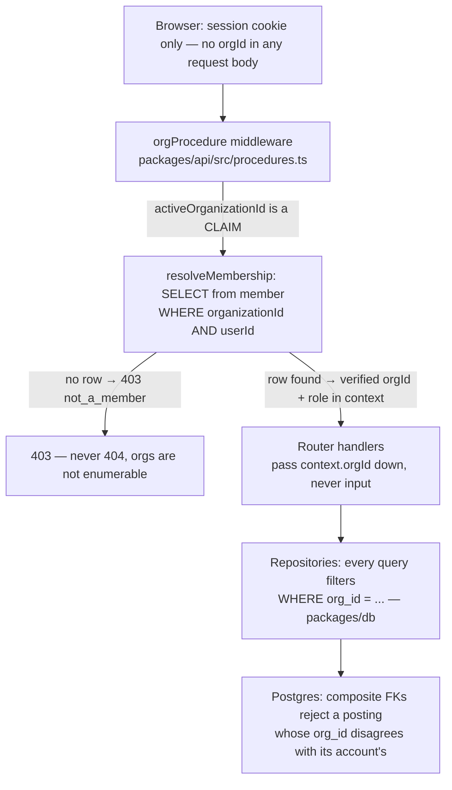

# Teardown #3 — Multi-tenancy without data leaks

Every multi-tenant system is one forgotten `WHERE` clause away from a breach. The classic failure mode isn't exotic: an endpoint accepts an `orgId` from the client, or a repository trusts whatever org its caller passed, or a cache serves tenant A's rows under tenant B's name. This repo treats tenant isolation as invariant #5 — *no read or write ever crosses an org boundary* — and enforces it in layers, each one written down, each one tested. This article walks the actual code path.

## The layered defense



**Layer 1 — no procedure can even ask for an org.** The acting organization is never accepted as input; it is derived server-side. That's not a convention someone has to remember — [`no-org-input.test.ts`](../../../packages/api/src/routers/no-org-input.test.ts) walks the real oRPC router, introspects the real Zod input schemas of all 22 procedures (the count is pinned, so the guard can't silently go vacuous), and fails if any field named `orgId`, `organizationId`, `tenantId`, or similar appears. A future endpoint cannot reintroduce the hole without a red test.

**Layer 2 — the session's org is a claim, not a fact.** Better Auth's organization plugin (registered in [`packages/auth/src/index.ts`](../../../packages/auth/src/index.ts)) stores `session.activeOrganizationId`, but [ADR 0005](../../adr/0005-tenant-isolation.md) is explicit that this is caller-influenced, possibly stale state. The `requireOrg` middleware in [`procedures.ts`](../../../packages/api/src/procedures.ts) converts claim to fact:

```ts
const membership = await resolveMembership(db, session.activeOrganizationId, session.userId);

if (membership === null) {
  throw new ORPCError("FORBIDDEN", {
    message: "You are not a member of this organization.",
    data: { reason: "not_a_member" },
  });
}

return next({
  context: {
    orgId: membership.orgId,
    actorId: session.userId,
    role: membership.role,
  },
});
```

[`resolveMembership`](../../../packages/api/src/auth/membership.ts) is one indexed query against the `member` table for `(organizationId, userId)`. A session naming an org the user was removed from — or never joined — fails here. Because the membership is re-read on **every** org-scoped request rather than cached, revocation is immediate: ADR 0005 records the extra query per request as a deliberate cost, refused a cache precisely because it would reintroduce a stale-authorization window.

**Layer 3 — access control is structural, not per-handler.** Procedures build on a ladder — `publicProcedure → protectedProcedure → orgProcedure → adminProcedure` — and which rung a procedure sits on *is* its authorization decision. There are no ad-hoc role or tenant checks inside handlers — the only in-handler `403` is maker-checker's self-approval rule (`self_approve_forbidden`), which depends on the specific row being acted on and cannot live in middleware. The only way a handler obtains an `orgId` is `context.orgId`, from the middleware that verified it — see any router, e.g. [`accounts.ts`](../../../packages/api/src/routers/accounts.ts), where `pageAccounts(context.db, context.orgId, …)` is the only shape a query call takes.

**Layer 4 — every repository query is org-filtered.** In [`packages/db/src/repositories`](../../../packages/db/src/repositories), each read takes `orgId` as an explicit parameter and puts it in the `WHERE` clause — e.g. [`accounts.ts`](../../../packages/db/src/repositories/accounts.ts):

```ts
const rows = await db
  .select()
  .from(ledgerAccount)
  .where(eq(ledgerAccount.orgId, orgId))
  .orderBy(asc(ledgerAccount.name));
```

**Layer 5 — the database itself refuses structurally cross-org writes.** [`packages/db/src/schema/ledger.ts`](../../../packages/db/src/schema/ledger.ts) gives `ledger_posting` composite foreign keys, so even code that bypasses every layer above cannot write a posting whose `org_id` disagrees with its account's or transaction's owning org:

```ts
foreignKey({
  columns: [table.accountId, table.orgId],
  foreignColumns: [ledgerAccount.id, ledgerAccount.orgId],
  name: "ledger_posting_account_id_org_id_fk",
}).onDelete("cascade"),
```

## No existence oracle

`403` vs `404` chosen per-endpoint by instinct becomes an enumeration attack: if "exists but forbidden" and "doesn't exist" are distinguishable, a caller can map another tenant's IDs. ADR 0005 assigns status codes by category: another org's account is `404`, **byte-identical** to a genuinely missing one; `403` never speaks about another tenant's data — it is reserved for statements about the caller's own standing (no active org, not a member — including when the named org doesn't exist, so organizations aren't enumerable either — insufficient role, or maker-checker's self-approval bar). The test asserts identity down to the error body:

```ts
const crossOrg = await captureError(() => asOrgA().accounts.get({ accountId: orgBAccountId }));
const missing = await captureError(() => asOrgA().accounts.get({ accountId: randomUUID() }));

expect(crossOrg.status).toBe(404);
expect(crossOrg.code).toBe("NOT_FOUND");
expect(crossOrg.code).toBe(missing.code);
expect(crossOrg.status).toBe(missing.status);
expect(crossOrg.message).toBe(missing.message);
expect(crossOrg.data).toEqual(missing.data);
```

## The tests, at both layers

Two suites make different claims on purpose:

- [`packages/db/src/repositories/tenant-isolation.test.ts`](../../../packages/db/src/repositories/tenant-isolation.test.ts) proves the repositories filter: two seeded orgs with **identically named** accounts (so a leak would look plausible), cross-org `getAccountById` indistinguishable from a missing ID, a cross-org `postTransaction` rejected as `AccountNotFound` with org B's balance untouched and the rejection audited under the *calling* org, and a brand-new org seeing empty lists, not errors — all against real Postgres.
- [`packages/api/src/routers/tenant-isolation.test.ts`](../../../packages/api/src/routers/tenant-isolation.test.ts) proves the API *derives* the right org: seven read surfaces — accounts (list/get), transactions (list/get), reconciliation, audit (list/rejections) — called as org A see all of A and none of B, their responses never emit `orgId`, and — the forged-claim case — a session claiming org B with org A's user gets `403 not_a_member`, through the real middleware and real SQL. Repository tests alone couldn't catch a middleware that trusted the session claim; this suite exists for exactly that gap.

## The client side: don't fake a breach

[ADR 0009](../../adr/0009-console-session-and-tenant-model.md) covers a subtle console-side trap. Because no ledger procedure takes an `orgId`, TanStack Query's cache key for `accounts.list` is *the same key* in every org. Switching orgs without clearing the cache would render the previous tenant's balances under the new org's name — indistinguishable, on screen, from a real breach. So [`switchOrganization`](../../../apps/web/src/lib/org/session.ts) makes the clear non-optional:

```ts
await authClient.organization.setActive({ organizationId });
queryClient.clear();
await invalidateRouter();
```

The active org is session state owned by Better Auth — the console reads it through the plugin's own atoms and never mirrors it into application state, so a client copy can never disagree with the server's verified value. Sign-out clears the cache for the same reason.

## See it yourself

Step 6 of the [README's 5-minute demo](../../../README.md): sign in, run the seed scenarios, then use the org switcher in the top bar ([`org-switcher.tsx`](../../../apps/web/src/components/shell/org-switcher.tsx)) to create and switch to a second organization. Accounts, transactions, audit history — everything from org one vanishes; the new org starts empty. Grab an account ID from org one and request it via the API reference while acting as org two: a `404` identical to a random UUID's.

## Honest gaps

- **Postgres row-level security — added, closing this gap.** Read isolation used to live only in the API middleware and repository layer, so a job talking to `packages/db` directly bypassed it: composite foreign keys stopped it writing cross-org rows, nothing stopped it reading them. Migration [`0008_row_level_tenancy.sql`](../../../packages/db/drizzle/0008_row_level_tenancy.sql) adds an unprivileged `ledger_app` role that `withOrgScope` drops into per transaction, with policies comparing `org_id` to a per-transaction setting. Unset, that setting is `NULL`, and `org_id = NULL` is not `TRUE` — so an unscoped query now returns **nothing** rather than everything.
- **The client no longer derives its own role.** It used to: no procedure returned the caller's role, so the console applied `toLedgerRole` to the Better Auth member row itself, producing a hint that could be momentarily stale. `session.context` now returns `{ userId, orgId, role }` from the same `requireOrg` resolution every write is authorized by, so the console and the server cannot disagree. Writes were always enforced server-side regardless.

That's the shape of the argument this repo makes: not "we were careful," but "here is the machine check that makes carelessness fail CI, here is the query that turns a claim into a fact, and here is the test that calls the API as one tenant and proves the other is invisible."
