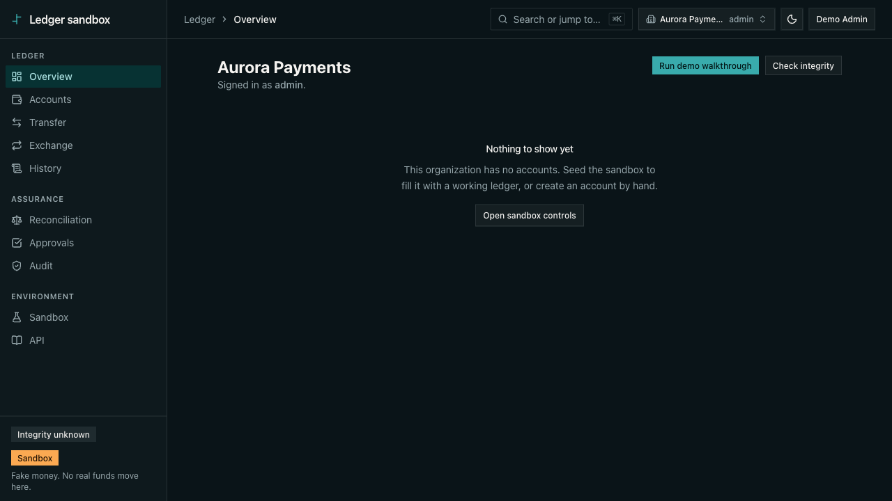
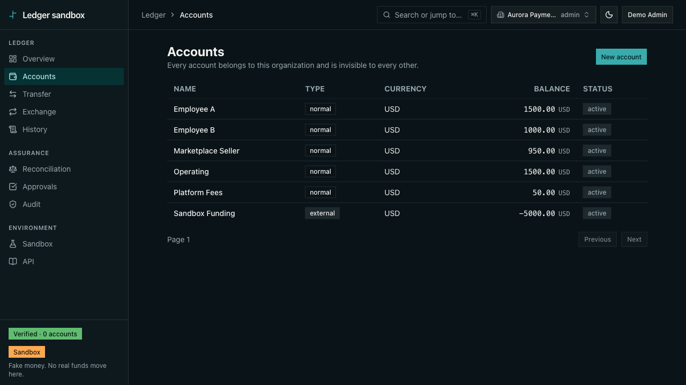

# Explainer videos — scripts & shot lists

Three short videos for technical evaluators, scripted against the **actual UI labels and routes** in [`apps/web/src`](../../../apps/web/src) — every on-screen name below was verified in source before it was written down. Companion pages: [Architecture](../architecture.md) · [the 5-minute demo](../../../README.md#5-minute-demo) · [API request flow](../../backend/api-flow.md).

## Recording checklist (before any take)

- [ ] `pnpm dev` — web console on `http://localhost:3001`, API on `http://localhost:3000` ([`README.md`](../../../README.md#getting-started)).
- [ ] A signed-up user with **one organization already created**, and (for video 1's B-roll and video 3) the sandbox scenarios run once so the ledger has data.
- [ ] Browser window at **1280×720**, default dark theme (the app defaults to dark — [`__root.tsx`](../../../apps/web/src/routes/__root.tsx)).
- [ ] **Hide the devtools badges.** TanStack Router/Query devtools render only under `import.meta.env.DEV` ([`__root.tsx`](../../../apps/web/src/routes/__root.tsx)), so record against a production build (`pnpm build`, then serve) — or accept the badges and crop the bottom edge. Don't ship a take with them visible.
- [ ] Mouse moves slow and deliberate; pause ~1s on anything the narration names.

**Where finished media lands:** commit MP4s/GIFs to `docs/showcase/videos/media/` and embed them at the `> 🎬 Embed:` marker at the top of each script below. GIF for the ≤30s loops, MP4 for the full cuts.

---

## Video 1 — The architecture in 90 seconds

**Target length:** 90s. Screen recording of [`docs/showcase/architecture.md`](../architecture.md) rendered on GitHub, scrolling diagram to diagram. No app footage — the page's mermaid diagrams are the visuals.

> 🎬 Embed: `media/architecture-90s.mp4`

**Hook:** *"Every box in these diagrams links to the file that enforces it. Ninety seconds, four diagrams, zero brochure."*

| # | Time | Screen/Action | Narration |
|---|------|---------------|-----------|
| 1 | 0:00–0:10 | Top of [`architecture.md`](../architecture.md), cursor underlines "this page is a map, not a brochure" | This is a double-entry, multi-tenant ledger sandbox. Its architecture page is a map: every claim links to the implementing file. Four diagrams, ninety seconds. |
| 2 | 0:10–0:30 | Scroll to [§1 System context](../architecture.md#1-system-context), hover the three server boxes | One Hono process, three surfaces: Better Auth at `/api/auth`, typed oRPC at `/rpc`, and the same router re-exposed as OpenAPI docs at `/api-reference` — so the docs are generated from the schemas that validate requests and can't drift from them. |
| 3 | 0:30–0:50 | Scroll to [§2 Monorepo package graph](../architecture.md#2-monorepo-package-graph), hover `packages/core`, then the `db → core` edge | The dependency graph is one-way and acyclic. `packages/core` — Money as bigint, balanced transactions, the funds rule — has zero runtime dependencies. And the database layer imports *core* at posting time, so every invariant has exactly one implementation, never a SQL restatement. |
| 4 | 0:50–1:15 | Scroll to [§3 Transfer write path](../architecture.md#3-transfer-write-path), trace the sequence diagram top to bottom | A write climbs a procedure ladder — session, verified membership, role, rate limit — then one Postgres transaction does everything: idempotency decided by a unique index, not a racy pre-check; account locks deduped and *sorted*, so deadlock is structurally impossible; postings, balances, and the audit entry commit together or not at all. That's ADRs [0003](../../adr/0003-balance-and-concurrency.md) and [0004](../../adr/0004-idempotency.md), and it's race-tested against real Postgres. |
| 5 | 1:15–1:30 | Scroll to [§4 Tenant isolation model](../architecture.md#4-tenant-isolation-model), hover the two dotted test boxes | Tenant isolation is four layers deep — the org is derived from a membership row, never accepted as input, down to composite foreign keys Postgres enforces itself. Two tests walk the real router and repositories to keep it that way. |

**CTA:** *"The page is `docs/showcase/architecture.md` — including the honest-gaps callouts. Click any box."*

---

## Video 2 — Watch money refuse to disappear

**Target length:** ~2:30. Screen recording of the live console: the README's [5-minute demo](../../../README.md#5-minute-demo) compressed to its five beats — funding → payroll → marketplace fee split → an *expected* refusal → a reversal — ending on the reconciliation proof.

> 🎬 Embed: `media/money-refuses-to-disappear.mp4` (voiced cut — to be recorded)

*Silent storyboard of this script, captured from the live app (each frame holds a few seconds): overview → sandbox → scenario outcomes (note the deliberate refusal) → the fee-split transaction → its journal netting to zero → reconciliation all green.*

**Naming note:** there is no element labeled *theater* in the shipped UI, and the README no longer refers to one — the placeholder directory that carried the name has been deleted. The shipped conservation proof is the transaction detail's **Journal** section with its **"Journal integrity → Nets to zero"** badge ([`postings-table.tsx`](../../../apps/web/src/features/transactions/postings-table.tsx), `data-testid="net-to-zero-proof"`). The narration below uses the real labels only.

| # | Time | Screen/Action | Narration |
|---|------|---------------|-----------|
| 1 | 0:00–0:10 | **Overview** page ([`_auth/index.tsx`](../../../apps/web/src/routes/_auth/index.tsx)); cursor rests on the **Run demo walkthrough** button, then the sidebar's **Verified** seal and **Sandbox** badge ("Fake money. No real funds move here.") | Fake money, real bookkeeping. In the next two minutes this ledger will pay salaries, split a marketplace fee, refuse a transfer, and undo one — without a single cent appearing or vanishing. |
| 2 | 0:10–0:25 | Click **Run demo walkthrough** → **Sandbox** page ([`sandbox.tsx`](../../../apps/web/src/routes/_auth/sandbox.tsx)). Click **Run scenarios** ([`sandbox-controls.tsx`](../../../apps/web/src/features/sandbox/sandbox-controls.tsx)) | One click posts the whole story: funding, a payroll run, a marketplace payout with a fee split, a transfer that *must* be refused, and a reversal. Every step goes through the same write path as the API — nothing is faked for the demo. |
| 3 | 0:25–0:50 | The **Scenario / Result / Transaction** table renders ([`scenario-outcomes.tsx`](../../../apps/web/src/features/sandbox/scenario-outcomes.tsx)). Point at each row: `funding`, `payroll`, `marketplace_payout` → **posted**; `insufficient_funds` → **refused as expected**; `reversal` and `reversal:reversal` → **posted** | Five scenarios, six rows — the reversal posts twice, original and mirror. Five posted. And one — look at the badge — *refused as expected*. That's not a failure state. The seed set deliberately includes a transfer a normal account can't afford, because a ledger that never says no proves nothing. |
| 4 | 0:50–1:20 | Click the `marketplace_payout` transaction id → **Transaction** detail ([`$transactionId.tsx`](../../../apps/web/src/routes/_auth/transactions/%24transactionId.tsx)). Scroll to the **Journal** section: debit/credit columns, **Totals** row, then the **Journal integrity → Nets to zero** badge | Here's the fee split as a journal: two debits — the seller's payout and the platform's fee — against one credit, totals equal on both sides. The "Nets to zero" badge isn't decoration — the client re-sums the legs as integers, rescaled to a common fraction width so `1.0` versus `10` can't fake a balance. Money moved; none was created. |
| 5 | 1:20–1:40 | Back to Sandbox. Point at the `insufficient_funds` row — no transaction link, just a dash. Then sidebar → **Audit** (hint: "The audit log and every recorded rejection") | The refused transfer posted *nothing* — no transaction id exists. But the refusal itself is recorded: rejections get their own audit trail, written in a separate transaction so the record survives the rollback ([ADR 0003](../../adr/0003-balance-and-concurrency.md)). |
| 6 | 1:40–2:05 | Open the `reversal:reversal` row's transaction (the `reversal` row links the *original*, which shows the red **reversed** badge instead). Point at the **reversal** badge and the sentence "The original is unchanged — history is append-only, so a correction is always a new entry" | And a mistake? You don't edit a ledger. The reversal is a *new* transaction with mirrored legs, rebuilt from the persisted rows — never from a request body. Database triggers block `UPDATE`, `DELETE`, and `TRUNCATE` on postings outright. |
| 7 | 2:05–2:30 | Sidebar → **Reconciliation** ([`reconciliation.tsx`](../../../apps/web/src/routes/_auth/reconciliation.tsx)). The banner: **"All N accounts reconcile"**. Click **Re-check**. End framed on the sidebar's **Verified · N accounts** seal ([`integrity-seal.tsx`](../../../apps/web/src/features/assurance/integrity-seal.tsx)) | The final word: every recorded balance compared against the signed sum of its own posting history, across the whole organization, on demand — not on a schedule. After funding, payroll, a fee split, a refusal, and a reversal: all accounts reconcile. That green "Verified" seal in the sidebar? It's this same check, running ambiently on real aggregates. |

**CTA:** *"Run it yourself — the README's 5-minute demo is this exact path. The write path behind it is one file: `packages/db/src/posting/post-transaction.ts`."*

---

## Video 3 — Two organizations, zero leaks

**Target length:** ~2:00. Screen recording: create a second org, watch the ledger go empty, then *try* to reach the first org's data and get told it doesn't exist.

> 🎬 Embed: `media/two-orgs-zero-leaks.mp4` (voiced cut — to be recorded)

*Silent storyboard, captured from the live app: the first organization's funded accounts, then the second organization's ledger — same user, same session, nothing to see.*

**Hook:** *"The most important thing this console can show you is nothing at all."*

| # | Time | Screen/Action | Narration |
|---|------|---------------|-----------|
| 1 | 0:00–0:15 | Seeded org on **Overview**. Open **History**, open any transaction, **copy its URL** to the clipboard. Point at the org switcher in the top bar (building icon, org name + role — [`org-switcher.tsx`](../../../apps/web/src/components/shell/org-switcher.tsx)) | This organization has accounts, history, balances. Keep an eye on this transaction — I just copied its URL. Now let's become someone else. |
| 2 | 0:15–0:40 | Org switcher → **Manage organizations** → **Organizations** page ([`organization.tsx`](../../../apps/web/src/routes/_auth/organization.tsx)). Read the intro line aloud-ish, type a name under **New organization name**, click **Create organization**, toast **"Created …"** | The page says it plainly: every account, transaction, and balance belongs to one organization and is invisible to every other. Let's create a second one and hold it to that. |
| 3 | 0:40–1:00 | Auto-navigated to **Overview** as the new org: empty state **"Nothing to show yet"**. Click through **Accounts** and **History** — both empty | Same user, same session, same browser — new organization. The ledger is empty. Not filtered-empty: the console wiped its entire query cache on the switch, because a stale cache would *look* like a leak in a system whose isolation is intact ([ADR 0009](../../adr/0009-console-session-and-tenant-model.md)). |
| 4 | 1:00–1:25 | Paste the copied transaction URL from step 1. The page renders the destructive alert: **"Transaction not found — No transaction with that id exists in this organization."** ([`errors.ts`](../../../apps/web/src/lib/ledger/errors.ts), [`states/index.tsx`](../../../apps/web/src/components/states/index.tsx)) | Here's the attempted leak. A real transaction id from the other org — and the answer is *not found*. Byte-identical to a genuinely missing id, by design: if "forbidden" and "missing" were distinguishable, you could enumerate another tenant's ids without ever reading a row ([ADR 0005](../../adr/0005-tenant-isolation.md)). |
| 5 | 1:25–1:45 | Cut to code on GitHub: [`no-org-input.test.ts`](../../../packages/api/src/routers/no-org-input.test.ts), then [`tenant-isolation.test.ts`](../../../packages/db/src/repositories/tenant-isolation.test.ts), then the composite FK in [`ledger.ts`](../../../packages/db/src/schema/ledger.ts) | And this isn't discipline — it's machinery. No API input schema may carry an org field; a test introspects the real router and fails if one appears. Every repository is tested for cross-org reads. And Postgres itself rejects any posting whose org disagrees with its account's, via composite foreign keys. |
| 6 | 1:45–2:00 | Back in the console: org switcher → original org, toast **"Switched organization"**, Overview repopulates. End on the **Verified** seal | Switch back, and everything's still there — verified, reconciled, and invisible to the org we just left. |

**CTA:** *"Four layers of isolation, two machine checks, one honest 404. The model is diagrammed in `docs/showcase/architecture.md`, section 4."*
